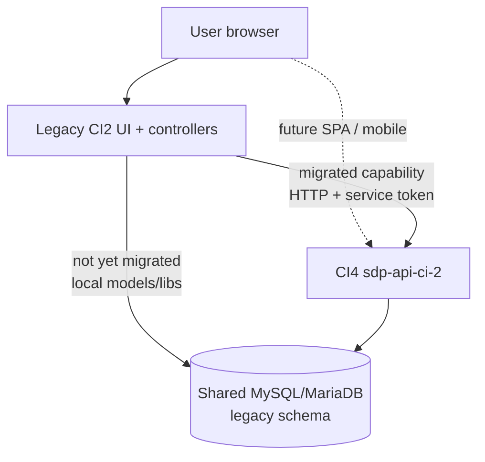
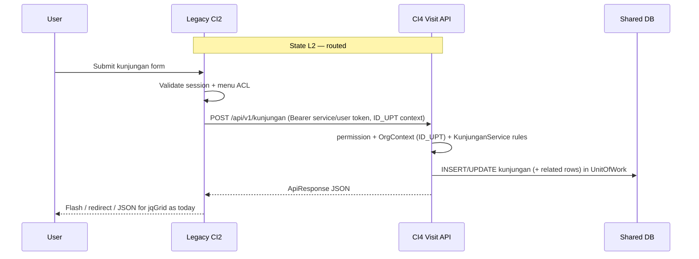
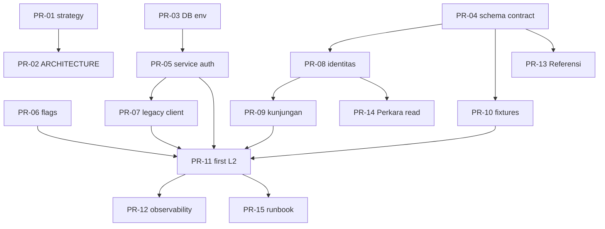

# SDP Legacy → CI4 API Migration Strategy

| Field | Value |
|-------|--------|
| **Document** | SDP Legacy → CI4 Modular API Migration Strategy |
| **Author** | _TBD_ |
| **Date** | 2026-07-29 (progress refresh 2026-07-30) |
| **Status** | Draft (rev 3.1 — shared DB + legacy→API strangler; API spine R0–R5 + M1) |
| **Audience** | Senior engineers, tech leads, product owners (Ditjenpas / SDP program) |
| **Source (legacy)** | **Canonical:** `/Users/hap/Documents/dev/sdp/102sdp` — focus `sdp/` + `system/` (CI **2.1.3**, Git `staging` @ 2026-07-28). **DB dump:** `102sdp/db_sdp_new_30072026.sql` (MariaDB `db_sdp`, ~454 tables). Older UPT dump `HTDOCS SDP` is reference-only. |
| **Target (new)** | `/Users/hap/Documents/dev/sdp/sdp-api-ci-2` — CodeIgniter 4 modular IMS API |
| **House style** | [`docs/ARCHITECTURE.md`](./ARCHITECTURE.md) (modules, thin controllers, services) — **data layer adapted for shared legacy schema** |
| **Module names** | Indonesian — [`docs/MODULE_NAMING.md`](./MODULE_NAMING.md) (`Wbp`, `Kunjungan`, `Mutasi`, …) |
| **Progress (API)** | [`docs/migration/PROGRESS.md`](./migration/PROGRESS.md) |
| **Supersedes** | rev 2 greenfield-schema + ETL + shadow/cutover-as-primary plan |

---

## Overview

Sistem Database Pemasyarakatan (SDP) is a large CodeIgniter 2 prison IMS (~612 controllers, ~361 models, ~2062 views, multi-10k-line remisi/integrasi libraries). The target is a modular CodeIgniter 4 API (`sdp-api-ci-2`) with thin controllers, services, RBAC, and org-aware filters.

**Hard product constraints (rev 3):**

1. **No domain database redesign.** The new API uses the **same database engine and the same table/column structure** as legacy (MySQL/MariaDB; tables such as `identitas`, `perkara`, `kunjungan`, `hukuman`, `remisi`, …).
2. **Transition runs two codebases** against that **one shared database**: legacy CI2 UI/app + new CI4 API.
3. **Strangler direction: legacy calls the new API.** When a capability is migrated, legacy controllers/libraries stop executing local business logic for that path and **HTTP-call the CI4 API** instead. The API owns writes (and usually reads) for that capability; both apps still see the same rows.

This is **not** a CI2→CI4 framework upgrade, not a greenfield schema rewrite, and not “ETL into new tables then cut over.” Value is delivered by **moving process logic** into the API while the **schema stays the system of record**.

**Implementability boundary:** Wave 0–1 (shared-DB models + auth bridge + first legacy→API proxy path) is executable from this document. Remisi/integrasi still need characterization fixtures and policy packages; Legal depth before remisi apply remains required.

---

## Background & Motivation

### Current state (legacy)

| Dimension | Reality |
|-----------|---------|
| Stack | CI 2.1.3, mysqli, session UI + jqGrid, REST digest under `controllers/api/` |
| Size | ~242 MB install; fat libs `Lib_remisi*` / `Lib_integrasi2*` (13–17k LOC each) |
| AuthZ | `MY_Controller` menu ACL R/W/N; UPT/Kanwil/Pusat modes |
| Data | Shared UPT DB (`sdp_upt` / `db_sdp`); soft deletes `IS_DELETED` / `IS_DELETE`; keys `NOMOR_INDUK`, `ID_PERKARA`, … |
| Outbound HTTP | Existing `Curl` library (Philip Sturgeon-style) — usable for legacy→API calls |

### Current state (target)

| Area | Status |
|------|--------|
| Core | Bearer auth, RBAC, `OrgContext`, `UnitOfWork`, hybrid topology concepts |
| Modules | Target names **Wbp / Kunjungan / Mutasi** (today still English folders `Inmate` / `Visit` / `Transfer` on greenfield tables) |
| Gap vs rev 3 | Greenfield migrations **conflict** with “same structure” — must be **rebased** onto legacy tables **and renamed** to Indonesian modules before production use |

### Pain points

1. Unmaintainable regulation forks in fat libraries.
2. No clean API for SPA/mobile; logic trapped in controllers + views.
3. Security/ops: session + digest, secrets in tree, weak modern audit patterns.
4. Dual-code risk if both stacks write the same process without a single owner.

### Why shared schema + legacy→API

| Driver | Effect |
|--------|--------|
| Legal continuity | Same rows, same PKs, no remapping risk for `NOMOR_INDUK` / hukuman / remisi history |
| Ops simplicity | One DB backup/restore story; no dual-SoR ETL lag |
| Incremental delivery | Migrate one process; point legacy at API; rest of UI keeps working |
| Existing skill | Legacy already has REST/Curl patterns for external calls |

---

## Goals & Non-Goals

### Goals

1. Move domain **capabilities** into CI4 modules per house style (thin controller → service → model).
2. **Keep legacy table/column structure** as the persistence contract for domain data.
3. Run **legacy + API together** on one DB during transition.
4. For each migrated capability, **legacy becomes a thin adapter** that calls the new API (session UX preserved).
5. Encode remisi/integrasi as **versioned policies** in the API (libs = specs, not paste).
6. Feature tests as the contract for each migrated process.
7. Preserve dependency discipline: facades only, `UnitOfWork` for multi-write **inside the API**.

### Non-Goals

1. **Not** redesigning or renaming domain tables/columns for “clean” CI4 schema.
2. **Not** bulk ETL into parallel `inmates` / `visits` tables as the production path.
3. **Not** porting views/jqGrid/CI2 controllers wholesale into CI4.
4. **Not** sharing a single PHP transaction across legacy HTTP → API (see Consistency).
5. **Not** early biometric, full PDF/surat, Bapas/Rupbasan, full DWH rewrite.
6. **Not** SPA work in this repo (API contracts only).
7. **Not** dual independent writers for the same capability (legacy DB write **and** API write for the same action).

---

## Key Constraints (normative)

| ID | Constraint |
|----|------------|
| C1 | **Same engine:** MySQL/MariaDB compatible with legacy (`mysqli` / CI4 MySQLi). |
| C2 | **Same structure:** Domain models map to **existing** tables and columns. No greenfield domain schema as SoR. |
| C3 | **Additive platform tables only with explicit approval** (e.g. `api_tokens` if `pengguna`/session cannot host API auth). Prefer reusing `pengguna` / existing ACL when feasible. |
| C4 | **Two codebases, one DB** during transition. |
| C5 | **Legacy → API** for migrated capabilities (HTTP). New SPA/clients may call API directly later. |
| C6 | **Single writer per capability:** once routed, **only the API** executes that process’s business writes. |
| C7 | **No fat-lib paste** into CI4. |

---

## Proposed Design

### Target architecture (transition)



### Capability states

| State | Legacy | API | DB writes for that process |
|-------|--------|-----|----------------------------|
| **L0 Local** | Full local logic | Absent or shadow-read only | Legacy only |
| **L1 Parallel build** | Full local logic | Implements + tests against **same tables** (dev/staging); **not** called from prod legacy | Legacy only (prod) |
| **L2 Routed** | Thin proxy (Curl) → API; no local business write | Owns process | **API only** |
| **L3 Direct** | Menu retired or UI replaced | Primary client is SPA/API consumers | API only |

Progression for each process family: **L0 → L1 → L2 → (optional) L3**.

### Strangler sequence (example: Visit / kunjungan)



### Control plane (routing, not schema cutover)

| Layer | Role |
|-------|------|
| **Legacy feature switch** | Per-process config (e.g. `sdp_api_routes['kunjungan'] = true` or preference row) — when on, controller uses proxy; when off, local logic |
| **API FeatureFlags** | Optional kill switch: reject writes if rollout must stop (`feature.kunjungan.write`) |
| **Rollback** | Flip legacy switch off → local logic resumes (code path still present until L3). **Do not** delete local path until L3 + soak |

No ETL “shadow database” is required for correctness: both stacks see the same rows. Optional **shadow** means: API implements L1 and ops compare API responses to legacy for the same inputs **without** routing traffic yet.

### Consistency & transactions (critical)

HTTP breaks shared DB transactions:

| Pattern | Guidance |
|---------|----------|
| **Preferred** | Entire business process (all related writes) runs **inside one API request** under `UnitOfWork`. Legacy only orchestrates HTTP + presentation. |
| **Forbidden** | Legacy `trans_begin` → partial local writes → HTTP to API → more local writes (split-brain, non-atomic). |
| **Multi-step UI** | Wizard steps that today share one legacy transaction must become **one API command** or **explicit multi-step API state** stored in DB (status columns that already exist). |
| **Idempotency** | Proxy sends `Idempotency-Key` (or natural key) so double-submit / retry does not double-insert. |

### Auth bridge (legacy → API)

Legacy users are session-authenticated (`pengguna`, NIP, roles). API expects Bearer tokens + org context.

**Recommended design:**

1. **Service principal** for legacy→API server-side calls (machine token stored in env on UPT host, not in git).
2. **On-behalf-of headers** from legacy session, e.g.:
   - `X-Actor-Nip` / `X-Actor-User-Id` — who clicked
   - `X-Org-Code` or `X-Id-Upt` — active UPT (must match session; API must not trust alone without binding to token scope)
3. API filter validates service token, then builds `OrgContext` from UPT and loads actor permissions (map menu R/W/N → `permission:*` or a transitional ACL adapter).
4. Audit logs record **actor** + **via=legacy-proxy**.

**Alternatives (later):** issue short-lived user tokens at legacy login (login once → API token in session); more moving parts.

### Org / multi-tenant mapping

| Legacy | API adaptation (shared schema) |
|--------|--------------------------------|
| `ID_UPT` on rows / session | `OrgContext` active unit = `ID_UPT` (or map to `organizations` **view/table only if already present**; do not invent parallel org IDs as SoR) |
| Kanwil / Pusat | Scope queries using existing legacy hierarchy tables (`upt`, `kanwil`) the same way legacy reports do |
| Topology `multi` in ARCHITECTURE.md | **Per-unit DB installs already match legacy.** ConnectionResolver may still select DB by org code; **schema inside each DB stays legacy.** Single shared national DB is a product choice, not required for pilot |

**Pilot:** one UPT DB (Cipinang-class), both codebases point at it.

### Data layer in CI4 (shared structure)

**Models bind to legacy tables:**

```php
// Illustrative — names follow legacy
class IdentitasModel extends Model
{
    protected $table         = 'identitas';
    protected $primaryKey    = 'NOMOR_INDUK'; // or auto-inc if that is the real PK — match DB
    protected $returnType    = \App\Modules\Wbp\Entities\Identitas::class;
    protected $allowedFields = [/* exact column names */];
    // Soft deletes: custom if column is IS_DELETED not deleted_at
}
```

| Concern | Approach |
|---------|----------|
| Column names | Keep DB columns; map to JSON `snake_case` in Entities / Resource transformers for API clients |
| Soft delete | Support `IS_DELETED` / `IS_DELETE` via model callbacks or raw conditions — do not require `deleted_at` unless column exists |
| Validation | Service-layer + model rules; mirror critical legacy checks |
| Surrogate keys | Use **existing** PKs/FKs; no `legacy_id_map` |
| New API-only tables | Only with approval (C3); never fork domain entities into parallel tables |

### Existing greenfield scaffolds in this repo

English scaffolds `app/Modules/Inmate` (`inmates`), `Visit` (`visits`), `Transfer` (`inmate_transfers`), and core `organizations` / RBAC tables **as currently migrated** are **provisional**.

| Action | When |
|--------|------|
| Freeze new greenfield domain migrations | Immediately |
| Rename modules to Indonesian ([`MODULE_NAMING.md`](./MODULE_NAMING.md)) | Wave 0 (or with first rebase PR) |
| Rebase modules onto legacy tables | Wave 0–1 (blocking for L1+) |
| Keep modular layout/services | Yes — names + persistence mapping change |
| Feature tests | Rewrite against legacy schema fixtures (SQL dump subset or anonymized seed) |

Platform tables (`users`, `api_tokens`, `roles`, …) need a **decision** (Open Questions): reuse `pengguna` + existing hak akses vs additive API tables alongside legacy.

### Business rules extraction (unchanged intent)

Fat libs remain **characterization sources**:

1. Identify process entrypoints (controller methods / `Lib_*` public methods).
2. Capture golden I/O fixtures against **shared DB** (anonymized).
3. Implement policy packages in CI4.
4. Parity tests: same inputs → same DB effects / DTO outputs.
5. At L2, legacy proxy calls API; local lib path disabled by switch.

### Remisi / integrasi

- Still **versioned strategies** (`SKEMAINT*` / `SKEMARMS*` → policy resolver).
- Still **no paste** of 16k-line files.
- Persist to **existing** `remisi` / integrasi tables and columns.
- Multi-stage usulan → TPP → SK: model as state on **existing** status fields; API owns transitions when L2.
- `applied` / mutasi package: entire package write inside API `UnitOfWork` when routed.

---

## Domain Decomposition & Dependency Graph

Legacy concepts → modules (logic ownership; **tables stay legacy names**):

| Legacy | Module (ID) | Tables (examples) | Wave |
|--------|-------------|-------------------|------|
| Parameter / referensi | **Referensi** | `daftar_referensi`, `jenis_registrasi`, parameter\* | **0–1** (plumbing + lookups for registrasi) |
| Identitas + **registrasi** (full L2 epic) | **Wbp** (+ **Perkara** for perkara/hukuman/kejahatan) | `identitas`, `perkara`, `history_registrasi`, `kejahatan`, `hukuman`, … | **1–3 (primary goal)** |
| Blok / kamar / penempatan | **Fasilitas** | blok, kamar, … | **2–3** (as needed by registrasi/placement) |
| Remisi | **Remisi** | `remisi`, related | **4** (after full registrasi L2) |
| Integrasi / PB / asimilasi | **Integrasi** (or under Remisi) | integrasi tables | **5** |
| Mutasi golongan + UPT/sel | **Mutasi** | `mutasi_golongan`, `mutasi_upt*`, … | **Now with registrasi epic (M1–M2)** — not deferred after Remisi |
| Keswat / obat / bama | **Keswat** | `keswat_*`, bama | **6** |
| Laporan / DWH | **Laporan** | reads | **6** |
| Kunjungan | **Kunjungan** | `kunjungan*` | **7 (late)** |
| Bapas / Rupbasan / biometric hardware | Deferred | … | **8+** |

Full naming rules: [`MODULE_NAMING.md`](./MODULE_NAMING.md).

**Product priority (rev 3.2):**

1. **Primary goal:** **Wbp / registrasi fully at L2** — legacy registrasi screens call the CI4 API; API owns all writes for the registrasi process family on the shared DB.
2. **Kunjungan late** (after registrasi and later domains).
3. Remisi/integrasi **after** registrasi L2 is complete (need stable perkara/hukuman/history).

Dependency DAG: `Referensi → Wbp ⇄ Perkara (registrasi commands) → Remisi → … → Kunjungan (late)`.  
During the registrasi epic, **Perkara is not optional** — registrasi always creates/updates perkara, kejahatan, hukuman, history. Prefer **orchestration Actions under Wbp** that call **Perkara** facade (or a dedicated `RegistrasiService` in Wbp that owns the UnitOfWork and uses Perkara models only via Perkara module).

---

## Epic: Wbp / Registrasi full L2

### Inventory (entrypoint map)

Canonical process map (controllers → R-slices → tables → API drafts):

**[`docs/migration/REGISTRASI_INVENTORY.md`](./migration/REGISTRASI_INVENTORY.md)** — built from `102sdp` + live `db_sdp`.  

Schema / PK / column contract for pilot tables:

**[`docs/migration/SCHEMA_CONTRACT.md`](./migration/SCHEMA_CONTRACT.md)** — from OrbStack `db_sdp`.

**Living progress (slices done vs open):**

**[`docs/migration/PROGRESS.md`](./migration/PROGRESS.md)**.

### Progress snapshot (2026-07-30)

API work on shared `db_sdp` (branch `feat/wbp-registrasi-r0-r5-m1`), **spine quality** — not full legacy form parity:

| Area | State |
|------|--------|
| R0–R2 | Done (referensi reads; identitas R/W) |
| R3–R5 | Done spine (registrasi create/edit; history R/W) |
| R6 | Basic list/show with R4 |
| R7 | Not started (optional admin) |
| R8 | Waived for pilot |
| M1 mutasi golongan | Done spine (`POST /api/v1/mutasi/golongan`, options/list) |
| M2 mutasi UPT | Not started |
| **L2 legacy→API proxy** | **Not started** (required for epic DoD) |
| Local setup | `.env.example` + README; smoke `php spark legacy:smoke-r01 --registrasi` |

**Still open for pilot DoD:** L2 proxies for registrasi + M1; richer MAP/keputusan/ekspirasi as production needs; feature tests beyond smoke; M2 when capacity allows.

**Near-term recommended next:** L2 proxy **or** M2 (product choice) — not R6 polish / R7 unless blocked.

### Goal

When this epic exits, **all production registrasi write paths used by UPT** are:

- Implemented in CI4 (**Wbp** + **Perkara** modules),
- Covered by feature tests,
- Reached from legacy via **HTTP L2** (single writer = API),
- Rollback-capable via legacy feature switches.

Legacy controllers (`Registrasi.php`, `ManajemenRegistrasi.php`, `ManajemenIdentitas.php`, `AddIdentitas.php`, `HistoryRegistrasi.php`, …) become thin proxies for those paths.

### Legacy gravity (approx.)

| Artifact | ~LOC | Role |
|----------|-----:|------|
| `controllers/Registrasi.php` | 3 077 | Create/edit registrasi, perkara forms, simpan, mutasi-in-reg UI |
| `controllers/ManajemenRegistrasi.php` | 2 992 | Management / search / ops |
| `controllers/ManajemenIdentitas.php` | 1 894 | Identitas management |
| `controllers/HistoryRegistrasi.php` | 2 106 | History views / ops |
| `controllers/AddIdentitas.php` | 987 | Add identitas |
| `libraries/Lib_identitas.php` | 547 | get/set identitas, perkara list |
| `libraries/lib_perkara.php` | 910 | Perkara helpers |
| `libraries/Lib_registrasi.php` | 490 | Mostly external party APIs (not full UI registrasi) |

Do **not** paste these files. Extract **process cards** + characterization fixtures.

### In scope (must be L2 for “full registrasi”)

Treat as one product epic with **slice delivery**, but **exit only when all in-scope slices are L2**.

| Slice ID | Process | Primary tables | API shape (illustrative) |
|----------|---------|----------------|---------------------------|
| **R0** | Lookups for forms | `jenis_registrasi`, `daftar_referensi`, instansi, dati2, … | `GET /api/v1/referensi/...` |
| **R1** | Search / show identitas | `identitas` | `GET /api/v1/wbp`, `GET /api/v1/wbp/{nomor_induk}` |
| **R2** | Create / update identitas | `identitas` (+ attribute history if used) | `POST/PUT /api/v1/wbp` |
| **R3** | Registrasi baru **+ RegistrasiMAP variant** | `identitas`, `perkara`, `kejahatan`, `hukuman*`, `history_registrasi`, … | `POST /api/v1/wbp/registrasi` (**one command**, one `UnitOfWork`; MAP branches in same family) |
| **R4** | Edit registrasi / perkara on existing WBP | same | `PUT /api/v1/wbp/registrasi/{id_perkara}` |
| **R5** | History registrasi read + **write (full parity with R4)** | `history_registrasi` | GET + update history APIs |
| **R6** | Manajemen list/search registrasi (read) | joins identitas/perkara | `GET /api/v1/wbp/registrasi` |
| **R7** | Jenis registrasi / golongan master (if UPT-writable) | `jenis_registrasi` | under Referensi or Wbp admin |
| **R8** | Documents in reg flow | dokumen | **Waived for pilot DoD** (K25) |
| **M1** | Mutasi golongan | `mutasi_golongan`, perkara/history | Mutasi module `POST /api/v1/mutasi/golongan` **now** |
| **M2** | Mutasi UPT package | `mutasi_upt*` | Mutasi module **after** M1 + R3/R4 |

**Hard rule:** multi-table create/edit (R3/R4/R5 write) is **one API request** owning the full transaction — legacy must not half-write locally then call API.

### Out of scope for pilot DoD (explicit)

| Item | Where it goes |
|------|----------------|
| **R8 dokumen** | Waiver — later slice |
| **sidik_jari / usertbl** on identitas delete | Deferred |
| **Portir** | Out of this epic |
| **Kunjungan** | Wave 7 late |
| **Remisi / integrasi apply** | After reg + M1 |
| **Biometric** / party REST / Bapas / Rupbasan | Deferred |
| Full **PDF/surat** | Later |
| **M2 Mutasi UPT** | After M1 + R3/R4 (not pilot-blocking) |

### Module split inside the epic

```text
Wbp (grown)
  Actions/DaftarWbp.php          # identitas only if needed
  Actions/RegistrasiBaru.php     # R3 — UnitOfWork
  Actions/UbahRegistrasi.php     # R4
  Services/WbpService.php        # facade
  Services/WbpQueryService.php   # R1, R5, R6 reads
  Models → identitas, …

Perkara
  Services/PerkaraService.php    # create/update perkara, kejahatan, hukuman
  Models → perkara, kejahatan, hukuman, history_registrasi (or shared)

Referensi
  jenis_registrasi, daftar_referensi, …  # R0, R7
```

Cross-module: `RegistrasiBaru` may call `PerkaraService` **inside** outer `UnitOfWork` (nest-safe). No cycles: Perkara must not call Wbp registrasi actions.

### Delivery slices (still “full L2” at the end)

Build **incrementally**, flip L2 **per slice**, but epic **Definition of Done** = all in-scope slices L2 on pilot UPT.

| Phase | Slices | L2 flips |
|-------|--------|----------|
| Plumbing | R0 (+ proxy kit) | Optional small Referensi L2 **or** read-only R0 first |
| Read spine | R1, R6, R5 | Can stay L1 (API-only clients) until writes ready; or L2 if legacy list screens proxy |
| Write spine | R2 → R3 → R4 | **Must** L2; R3 is the critical path |
| Closeout | R5 write parity, R7 as needed, M1 L2; residual identitas paths | Pilot menus proxied; R8 waived |

### Epic exit criteria (Definition of Done)

- [ ] Capability inventory lists every in-scope legacy entrypoint → API command; none left on local write for pilot UPT.
- [ ] R3/R4 feature tests: multi-table assert (identitas + perkara + kejahatan + hukuman + history) + rollback on mid-failure.
- [ ] Characterization fixtures from anonymized staging clone for at least N happy-path + edge golongan/jenis_reg.
- [ ] Legacy switches on for R2–R4; dual-writer incidents = 0.
- [ ] Audit: actor + via=legacy-proxy + id_perkara / nomor_induk.
- [ ] Runbook: freeze optional only if needed; rollback per-slice switches.
- [ ] Explicit **out-of-scope** list signed (biometric, mutasi UPT, party APIs, kunjungan).

### Risks specific to full registrasi L2

| Risk | Mitigation |
|------|------------|
| God-action R3 too large | Split validation DTOs; keep one UnitOfWork; sub-builders inside Action |
| Hidden side writes (sidik_jari, usertbl, exchange) | Inventory during R3 TD spike; include or explicitly exclude |
| Jenis registrasi / tahanan vs narapidana branches | Table-driven rules + fixtures per `ID_REG` family |
| Edit path diverges from create | Shared domain builders; separate Action entrypoints |
| Legacy wizard multi-step | Collapse to one API command or API-side draft status if legacy already has draft |

---

## Suggested migration order (priority ladder)

| Priority | Slice | Notes |
|----------|--------|--------|
| **P0** | Foundation (Wave 0) | Auth, proxy, inventory focused on **registrasi** entrypoints |
| **P1** | Referensi R0 | Lookups required by registrasi forms |
| **P2** | Wbp/Perkara **read** R1, R5, R6 | Search identitas & registrasi lists |
| **P3** | **Registrasi full L2** R2→R3 (incl. MAP)→R4→R5 write parity→R6 (+ R7) | Primary goal; R8 waived |
| **P3b** | **Mutasi now** — M1 golongan; **M2 after** M1+R3/R4 | Mutasi module; reg UI L2-calls Mutasi for golongan |
| **P4** | Fasilitas (if needed for placement / mutasi sel) | Parallel with Mutasi as needed |
| **P5** | Remisi | After registrasi + mutasi-golongan L2 stable |
| **P6** | Integrasi | |
| **P7** | Keswat / Laporan | |
| **P8** | **Kunjungan (late)** | |
| **P9** | Deferred | Biometric, Bapas, Rupbasan, party exchange APIs |

**Plumbing-first option:** a tiny Referensi L2 can still ship before R3 to prove the proxy stack, but it is **not** a substitute for full registrasi L2.

---

## Phased Roadmap

### Wave 0 — Foundation for registrasi epic (3–5 weeks)

- Inventory **all** registrasi-related controllers/methods → slice map (R0–R8).
- Schema contract: `identitas`, `perkara`, `kejahatan`, `hukuman*`, `history_registrasi`, `jenis_registrasi`.
- Auth bridge + legacy `Sdp_api_client` + switches.
- TD spike: walk one full `Registrasi::simpan` / `insert` path; list every table touched.

**Exit:** ping + inventory + schema pack + side-write list for R3.

### Wave 1 — Referensi R0 + Wbp/Perkara reads (R1, R5, R6) (4–8 weeks)

- Models on legacy tables; query APIs; feature tests.
- Optional: first micro L2 on one Referensi write to prove proxy.

**Exit:** API can power registrasi form lookups and search/show without greenfield `inmates` tables.

### Wave 2–3 — **Registrasi full L2** (primary) (12–20 weeks)

- **R2** identitas write L2.
- **R3** `POST .../registrasi` command (full multi-table) L2 — characterization + feature tests.
- **R4** edit registrasi L2.
- **R7/R8** as required for UPT production path.
- Legacy proxies on `Registrasi`, `ManajemenRegistrasi`, `ManajemenIdentitas`, `AddIdentitas`, history screens for in-scope actions.
- Fasilitas only if blocking.

**Exit:** epic DoD above (full in-scope registrasi L2 on pilot UPT).

### Wave 4 — Remisi (after registrasi L2)

### Wave 5 — Integrasi + Mutasi UPT

### Wave 6 — Keswat + Laporan

### Wave 7 — Kunjungan (late)

### Wave 8+ — Deferred (biometric, Bapas, Rupbasan, party APIs, full surat)

---

## Module Implementation Playbook

For each process family:

1. **Inventory** — entry URLs, libs, tables touched, transaction boundaries.
2. **Contract** — API request/response + error mapping; match what legacy UI needs.
3. **Models** — bind to **existing** tables; Entity transformers for JSON.
4. **Service** — rules + OrgContext (`ID_UPT` scope) + `UnitOfWork`.
5. **Feature tests** — arrange legacy-like rows; assert rows + HTTP envelope.
6. **Legacy proxy** — switchable client call; map API errors to legacy UX.
7. **Staging L1** — compare API vs legacy outputs offline.
8. **L2 flip** — pilot UPT; monitor; rollback switch ready.
9. **L3** — only after product retires legacy screen.

---

## API / Interface Changes

### Envelope (existing)

Keep `ApiResponse` success/error shape for new clients. Legacy proxy may unwrap into legacy JSON/flash.

### Headers (transition)

| Header | Purpose |
|--------|---------|
| `Authorization: Bearer <service-or-user-token>` | Auth |
| `X-Id-Upt` / `X-Org-Code` | Unit context (must be authorized for token) |
| `X-Actor-Nip` | On-behalf-of user |
| `Idempotency-Key` | Safe retries |
| `Accept: application/json` | ForceJson |

### Legacy client sketch (CI2)

```php
// application/libraries/Sdp_api_client.php (illustrative)
class Sdp_api_client {
    public function post($path, array $body, array $meta = []) {
        $this->ci->load->library('curl');
        $headers = [
            'Authorization: Bearer ' . getenv('SDP_API_SERVICE_TOKEN'),
            'X-Id-Upt: ' . $meta['id_upt'],
            'X-Actor-Nip: ' . $meta['nip'],
            'Idempotency-Key: ' . ($meta['idempotency_key'] ?? uniqid('sdp', true)),
            'Content-Type: application/json',
            'Accept: application/json',
        ];
        // curl post to rtrim(base,'/').'/'.ltrim($path,'/')
        // throw / return normalized errors for MY_Controller flash
    }
}
```

Route switch:

```php
if ($this->config->item('api_route_kunjungan')) {
    $result = $this->sdp_api_client->post('api/v1/kunjungan', $payload, $meta);
} else {
    // existing local lib/model path
}
```

---

## Data Model Changes

| Category | Policy |
|----------|--------|
| Domain tables | **No structural change** as SoR |
| Indexes | Additive indexes allowed if proven necessary for API query patterns (ops-approved DDL) |
| API platform | Prefer reuse `pengguna`/ACL; additive token table only if approved (C3) |
| Greenfield CI4 migrations | **Do not deploy as production domain schema**; rebase or drop from migrate path |

---

## Alternatives Considered

| Option | Pros | Cons | Verdict |
|--------|------|------|---------|
| **A. Shared schema + legacy→API** | No data remap; true dual-code; UI continuity | HTTP txn boundary; proxy work in CI2 | **Adopt (rev 3)** |
| **B. Greenfield + ETL** (rev 2) | Clean CI4 schema | Dual SoR, legal remap risk, ETL lag | **Rejected by product** |
| **C. API-only rewrite, freeze legacy UI** | Clean client story | No transition UX; big-bang per screen | Reject for transition |
| **D. Shared schema, both write locally** | No HTTP | Divergent logic forever; worst dual-code | **Reject** |
| **E. DB views / synonyms only** | Fast reads | Does not move business rules | Optional read helper only |

---

## Security & Privacy

| Topic | Control |
|-------|---------|
| Service token | Env on UPT app server; rotate; least privilege |
| On-behalf-of | Never trust `X-Actor-*` without valid service token; bind UPT to token allow-list |
| PII | Same DB sensitivity as today; redact logs (NOMOR_INDUK partial, names) |
| Transport | HTTPS between legacy and API (same host reverse-proxy or internal TLS) |
| Secrets | Never commit `database.php` passwords; rotate sample credentials |
| Permissions | Map legacy menu R/W/N → API permissions; deny by default on new routes |

---

## Observability

| Signal | Use |
|--------|-----|
| `sdp.proxy.request` | path, id_upt, actor, latency, status |
| `sdp.api.legacy_via` | count of requests with via=legacy-proxy |
| Error rate / 5xx | Rollback trigger for L2 switch |
| Idempotency conflicts | Detect double-submit |
| Audit | Who / which process / via proxy or direct |

---

## Rollout Plan

1. **Dev:** API + legacy against local/shared Docker MariaDB with schema dump.  
2. **Staging:** anonymized UPT clone; L1 parity tests.  
3. **Pilot L2:** one process, one UPT; switch on.  
4. **Expand L2** process-by-process.  
5. **L3** when UI replaced or menu retired.  

**Rollback:** legacy switch off (immediate). API kill flag optional.

---

## Risk Register

| ID | Risk | Severity | Mitigation |
|----|------|----------|------------|
| R1 | Split-brain dual writers | Critical | C6 single writer; switches; code review checklist |
| R2 | Non-atomic HTTP boundary | Critical | Whole process in one API `UnitOfWork` |
| R3 | Auth spoofing via headers | Critical | Service token + UPT allow-list; ignore bare headers |
| R4 | Latency / availability of API takes down UI | High | Timeouts, clear errors, fast rollback switch; colocate API |
| R5 | Greenfield scaffolds confuse team | High | Rebase Wave 0; docs status “non-prod schema” |
| R6 | Fat-lib paste | High | Policy packages + fixtures |
| R7 | Soft-delete column inconsistency | Medium | Per-table model config from schema pack |
| R8 | Kanwil scope bugs | High | Reuse proven legacy scope queries in services |
| R9 | Secret leakage | Critical | Env-only; rotate |
| R10 | Idempotency gaps → duplicate rows | High | Keys + unique constraints where legacy has them |

---

## Success Metrics

| Metric | Target |
|--------|--------|
| Processes at L2 | Increasing; inventory % tracked |
| Dual-writer incidents | **0** |
| Proxy p95 latency | Budget vs local (e.g. &lt; +200ms internal) |
| Feature tests for L2 processes | 100% |
| Rollback drill | Proven each pilot |
| Schema drift (unapproved DDL) | 0 |

---

## Key Decisions

| # | Decision | Rationale |
|---|----------|-----------|
| K1 | Rewrite **logic** into CI4 modules, not framework upgrade | Maintainability |
| K2 | **Shared legacy DB structure** is SoR | Product constraint; legal continuity |
| K3 | **No greenfield domain schema** / no ETL remap path | Supersedes rev 2 K3 |
| K4 | **Two codebases** during transition on one DB | Product constraint |
| K5 | **Legacy → API HTTP** for migrated capabilities | Strangler with UI continuity |
| K6 | **Single writer** per capability after L2 | Avoid split-brain |
| K7 | Entire process in one API transaction | HTTP cannot share legacy `trans_*` |
| K8 | Service token + on-behalf-of actor/UPT | Bridge session → API |
| K9 | Per-process **legacy switch** for route/rollback | Ops simplicity |
| K10 | Remisi/integrasi = versioned policies on **existing** tables | Spec from fat libs, no paste |
| K11 | Rebase existing greenfield modules onto legacy tables | Align repo with K2 |
| K12 | Additive indexes OK; additive tables only with approval | C3 |
| K13 | Feature tests on legacy-shaped data | Contract = real schema |
| K14 | Defer biometric, full surat, Bapas, Rupbasan | Focus |
| K15 | Pilot = one UPT DB, both apps configured to it | Matches install model |
| K16 | **Indonesian module names** (`Wbp`, `Kunjungan`, `Mutasi`, `Remisi`, `Perkara`, `Keswat`, `Fasilitas`, `Referensi`, `Laporan`) | Domain language matches SDP/legacy; see [`MODULE_NAMING.md`](./MODULE_NAMING.md) |
| K17 | **Kunjungan migrates late** — after registrasi epic and later domains | Visits stay on legacy longer |
| K18 | **Primary migration goal = Wbp/registrasi L2** (R0–R7 + MAP as R3; R5 write parity; R8 waived) + **M1 Mutasi** | Product pilot DoD — see inventory §10 |
| K19 | Multi-table registrasi create/edit = **single API command + UnitOfWork** | HTTP cannot share legacy transactions |
| K20 | Perkara (perkara/kejahatan/hukuman/history) is **in** the registrasi epic via Perkara facade | Registrasi is not identitas-only |
| K21 | Out of near-term epic: biometric, party exchange APIs, kunjungan, remisi (until after reg+mutasi) | Keep finishable |
| K22 | **Mutasi domain now** — M1 mutasi golongan in Mutasi module (not buried in R4 DTO). **M2 mutasi UPT follows M1 + R3/R4** | Product: golongan with reg UI; UPT package next |
| K23 | **RegistrasiMAP = R3 variant now** | Same create command family as core registrasi |
| K24 | **HistoryRegistrasi write = full parity with R4** | Not read-only R5 first |
| K25 | **R8 dokumen waived** for pilot DoD; **sidik_jari/usertbl delete deferred**; **Portir out** | Keep pilot finishable |

---

## Open Questions

Remaining (not blocking registrasi + M1 pilot):

1. **Password / user sync:** API users 1:1 with `pengguna`?
2. **Deployment topology:** API colocated on UPT host vs central farm?
3. **Kanwil app:** same dual-code pattern or later?
4. **OpenAPI:** Markdown through registrasi epic vs early OpenAPI?
5. **Existing greenfield migrations:** delete vs keep for isolated demos only?

### Resolved product inputs (rev 3.3)

| Topic | Decision |
|-------|----------|
| Domain schema | Unchanged legacy structure |
| Engine | Same MySQL/MariaDB |
| Transition | Two codebases, one DB |
| Strangler | Legacy HTTP → new API |
| API auth tables | Additive tokens; map to `pengguna` |
| Module names | Indonesian — [`MODULE_NAMING.md`](./MODULE_NAMING.md) |
| Kunjungan | Late |
| Primary pilot | R0–R7 + RegistrasiMAP as R3; R5 write = R4 parity; **M1 Mutasi now**; **M2 after** M1+R3/R4 |
| R8 dokumen | **Waiver** |
| sidik_jari/usertbl delete | **Defer** |
| Portir | **Out** |
| Registrasi transaction | One API command + UnitOfWork (R3/R4/R5 write) |
| Inventory | [`docs/migration/REGISTRASI_INVENTORY.md`](./migration/REGISTRASI_INVENTORY.md) §10 |

---

## References

- Target: `docs/ARCHITECTURE.md`, `app/Modules/*`, `app/Services/*`, `tests/_support/Feature/ApiFeatureTestCase.php`
- Legacy canonical: `/Users/hap/Documents/dev/sdp/102sdp` — `system/application/{controllers,models,libraries,config}`, web root `sdp/`; SQL evolution in `querybox/`; schema+seed dump `db_sdp_new_30072026.sql`. Local OrbStack MariaDB: container `sdp-mariadb` on **127.0.0.1:3307**, DB `db_sdp` (see `102sdp/docs/LOCAL_DEV_DB.md`). CI4 `sdp-api-ci-2` `.env` `database.default.*` points at the same instance (shared schema). **Do not** run greenfield `php spark migrate` against `db_sdp` until migrations are redesigned for legacy tables.

---

## PR Plan

**Scope:** foundation for shared-DB + proxy strangler + first L2 wedge.  
**Non-goals:** remisi engine complete, greenfield ETL loaders, dual-write outbox to a second schema.

### Timeline

| Window | Focus |
|--------|--------|
| **Month 1** | Foundation + schema pack for registrasi tables + proxy kit + R0/R1 reads |
| **Month 2–5** | Registrasi R2→R3(+MAP)→R4→R5 write→R6; **M1 Mutasi golongan**; then **M2 UPT** |
| **Month 6+** | Remisi → Integrasi → Keswat/Laporan → **Kunjungan late** |

---

### PR-01 — Docs: rev 3 strategy + inventory scaffold

| | |
|--|--|
| **Title** | `docs: shared-DB migration strategy + capability inventory` |
| **Files** | `docs/MIGRATION_STRATEGY.md`, `docs/inventory/*`, note in `ARCHITECTURE.md` (data layer caveat) |
| **Depends on** | None |

### PR-02 — ARCHITECTURE caveat: shared legacy schema

| | |
|--|--|
| **Title** | `docs: ARCHITECTURE shared-schema and legacy-proxy notes` |
| **Files** | `docs/ARCHITECTURE.md` (OrgContext ↔ `ID_UPT`, no greenfield domain SoR) |
| **Depends on** | PR-01 |

### PR-03 — Secrets hygiene + DB config for real MariaDB legacy schema

| | |
|--|--|
| **Title** | `chore: production-shaped DB config + .env.example (no secrets)` |
| **Files** | `app/Config/Database.php`, `.env.example` |
| **Depends on** | None |
| **Description** | Point default/dev at MariaDB dump of legacy structure when available; SQLite only for pure unit tests that mock DB. |

### PR-04 — Schema contract pack (pilot tables)

| | |
|--|--|
| **Title** | `docs: schema contract for identitas, kunjungan, pengguna, upt` |
| **Files** | `docs/migration/schema-contract.md` (PK, FKs, soft-delete cols, critical indexes) |
| **Depends on** | Access to DB dump or models |

### PR-05 — Service auth + on-behalf-of filters

| | |
|--|--|
| **Title** | `feat(auth): service token + actor/UPT context for legacy proxy` |
| **Files** | filters, `AuthService` or `ServiceTokenAuth`, config, tests |
| **Depends on** | PR-03; OQ-1 resolution for token storage |

### PR-06 — FeatureFlags kill switch

| | |
|--|--|
| **Title** | `feat(core): FeatureFlags for API write kill switches` |
| **Files** | `app/Services/FeatureFlags.php`, tests |
| **Depends on** | None |

### PR-07 — Legacy Sdp_api_client kit (in legacy tree or documented patch)

| | |
|--|--|
| **Title** | `feat(legacy): Sdp_api_client + route switch helper` |
| **Files** | Legacy `application/libraries/Sdp_api_client.php`, config keys, sample usage doc in `docs/migration/legacy-proxy.md` |
| **Depends on** | PR-05 contract |
| **Description** | Lives in legacy codebase; this repo holds the integration contract doc + example. |

### PR-08 — Wbp + Perkara models on legacy tables (read)

| | |
|--|--|
| **Title** | `feat(Wbp/Perkara): identitas + perkara read models on legacy schema` |
| **Files** | Models for `identitas`, `perkara`, …; R1/R6 query APIs; feature tests |
| **Depends on** | PR-04 |

### PR-09 — Referensi lookups for registrasi forms (R0)

| | |
|--|--|
| **Title** | `feat(Referensi): jenis_registrasi + daftar_referensi reads` |
| **Files** | Referensi module; `/api/v1/referensi/...` |
| **Depends on** | PR-04 |
| **Description** | Unblocks registrasi form data (R0). |

### PR-10 — Legacy-shaped test fixtures harness

| | |
|--|--|
| **Title** | `test: legacy schema fixture loader for ApiFeatureTestCase` |
| **Files** | `tests/_support/*`, sample SQL/JSON seeds for identitas/kunjungan |
| **Depends on** | PR-04 |

### PR-11 — Optional micro-L2 (proxy proof) or jump to R2

| | |
|--|--|
| **Title** | `feat: first legacy→API L2 (Referensi micro **or** identitas write R2)` |
| **Files** | Proxy + switch + one write path |
| **Depends on** | PR-05–PR-10, PR-07 |
| **Description** | Prefer shortest path to prove proxy, then focus on R3. |

### PR-11b — RegistrasiBaru command (R3) + characterization

| | |
|--|--|
| **Title** | `feat(Wbp): POST registrasi multi-table command (R3)` |
| **Files** | `Actions/RegistrasiBaru.php`, Perkara facade, fixtures, feature tests |
| **Depends on** | PR-08, PR-09, UnitOfWork, auth |
| **Description** | Core of full registrasi L2; single UnitOfWork. |

### PR-11c — UbahRegistrasi (R4) + legacy proxy for Registrasi.php

| | |
|--|--|
| **Title** | `feat(Wbp): PUT registrasi + legacy L2 proxy for create/edit` |
| **Files** | `Actions/UbahRegistrasi.php`, legacy switches on Registrasi controllers |
| **Depends on** | PR-11b |

### PR-12 — Observability + audit via=legacy-proxy

| | |
|--|--|
| **Title** | `feat: proxy metrics and audit actor attribution` |
| **Files** | logging helper, audit writer |
| **Depends on** | PR-05, PR-11 |

### PR-13 — Referensi reads from `daftar_referensi` (+ peers)

| | |
|--|--|
| **Title** | `feat(Referensi): data referensi on legacy tables` |
| **Files** | `MasterData` → `Referensi` module |
| **Depends on** | PR-04 |

### PR-14 — Perkara read: perkara + hukuman

| | |
|--|--|
| **Title** | `feat(Perkara): read models on perkara/hukuman` |
| **Files** | `Legal` → `Perkara` module |
| **Depends on** | PR-08 |

### PR-15 — Pilot L2 runbook + rollback drill checklist

| | |
|--|--|
| **Title** | `docs: L2 rollout and rollback runbook` |
| **Files** | `docs/migration/runbooks/l2-proxy-rollout.md` |
| **Depends on** | PR-11 |

### PR-16+ — Further L2 routes, Remisi policies, Mutasi, etc.

Ordered by inventory priority; each PR = one process family slice + tests + legacy switch.

### PR dependency graph



---

*End of design document (rev 3).*
